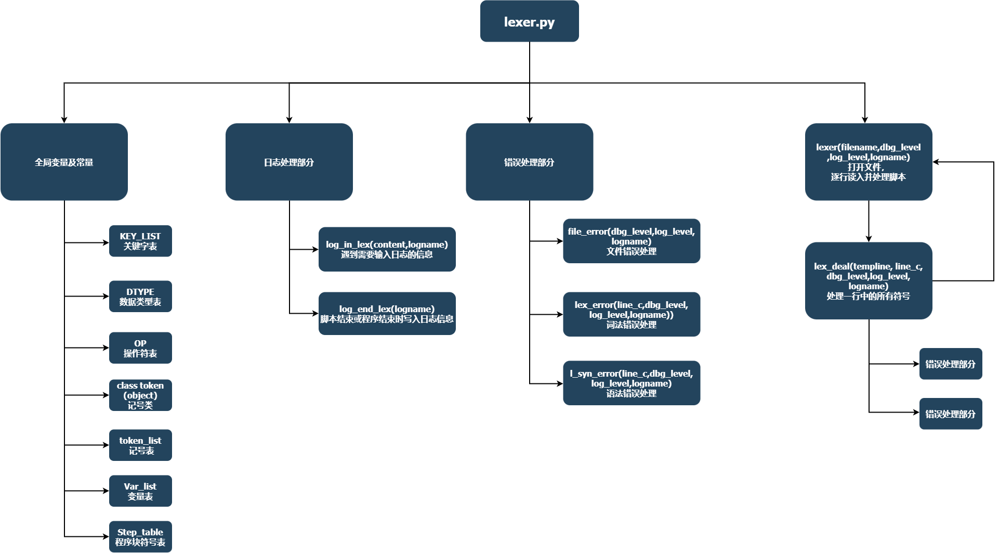
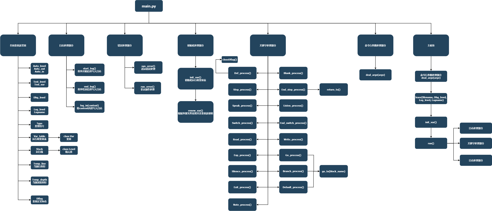

# DSL领域特定语言设计 ——chatbot

---

## 设计说明

### 流程图


### 数据结构设计及模块划分

#### 数据结构

类定义：
`lexer.py`

```python
# 记号有四个属性，名字，类型，值，行号
class token(object):
    def __init__(self, name, type, value, line):
        self.name = name
        self.type = type
        self.val = value
        self.line = line

```

`main.py`

```python
# 变量类型
class Var(object):
    def __init__(self, name, type, val):
        self.name = name
        self.type = type
        self.val = val


# 栈元素
class Level(object):
    def __init__(self, depth, line, sflag, smember):
        self.depth = depth
        self.line = line
        self.sflag = sflag
        self.smember = smember
```

全局变量及常量：
`lexer.py`

```python
KEY_LIST = [
    "Def", "Step", "End_step", "Speak", "Listen", "Switch", "End_switch",
    "Branch", "Default", "Go", "Exp", "Write", "Read", "Slience", "Exit"
]
DTYPE = ["Num", "Str"]
OP = ["+", "-", "*", "/", "="]
# 符号表按行记录，每个元素是一行也是一个列表，子列表元素是token类的对象
token_list = []
# 词法分析的变量表只记录变量名
Var_list = []
# 程序块表记录程序块名以及程序块行号,是一个字典
Step_table = {}
```

`main.py`

```python
# 自动等级 当其为1，将标准输入输出重定向到指定文件，为0则在命令行窗口输入输出
Auto_level = 0
Auto_in = "./auto/auto1.in"
Auto_out = "./auto/auto1.out"
# 测试等级 当其为1，从指定文件读入构建变量表,默认为0
Test_level = 0
Test_var = "./var/test1.var"
# 调试等级，是否输出调试（错误）信息,默认输出
Dbg_level = 1
# 日志等级，是否将脚本运行详情运行写入日志，默认为1（写入）
Log_level = 1
Logname = "./log/dsl_rsl.log"
# 类型符号
Type = ["KEY", "DTYPE", "BLOCK", "NOTE", "OP", "NUM", "STRING", "BOUND", "ID"]
# 运行时全局变量表
# 变量名，类型，值
Var_table = []
# 栈信息
# 层深，行号，该层switch（选择分支）控制符,选择分支，比较符
Stack = []
# 当前行指针
Temp_line = 0
# 当前层深
Temp_depth = 0
# 允许定义变量标志
Dflag = 1
```

#### 模块

`lexer.py`



`main.py`



### 运行原理

1. 该脚本解释器运行时，根据命令行参数，确定脚本文件地址，设置解释选项等。
2. 调用 `lexer.py`，读入脚本，对脚本进行词法分析。
   词法分析按行进行，将识别出的每一个单词加入到符号表 `token_list`中，如果是标识符（ID），则构造该标识符，将其加入到变量表 `Var_list`中，如果是程序块符号（BLOCK）,则将其与行号记录到程序块表 `Step_table`中。
3. 构造符号表，变量表和程序块表后，对运行时变量表和状态栈进行初始化。将当前层次信息层深置为0，行号置为0，分支控制符置为允许。
4. 根据符号表 `token_list`，逐行进行语法分析与语义分析，同时执行语义动作。脚本从 `token_list`的第1行开始按行执行，第一个Step为主模块，直到遇到退出语句Exit或者主模块执行结束（状态栈记录处于0层，且识别到End_step）
5. 当遇到分支语句，先判断当前层次分支控制符是否开启，在开启的情况下允许比较分支和Default语句执行，当执行成功，关闭当前层次分支控制符，不再允许进行Branch或Default操作，直到遇到当前层的End_switch，重新开启当前层次分支控制符
6. 执行Branch、Default、Go语句意味着遇到跳转/程序块调用的操作，那么将首先保存当前层次的信息（行号，层深等），记录在状态栈中，再建立新的程序块的状态信息，将其入状态栈。跳转的操作是根据程序块表更新当前行号，到指定行继续按行执行
7. 遇到非0层的End_step语句，说明调用的程序块结束，但主模块未结束，这时需要进行返回，将状态栈顶元素删除，栈顶指针下移一位，返回旧的状态信息，将其设置为当前层状态信息，并获取旧的行号，从此开始继续执行
8. 遇到0层的End_step语句或者Exit语句，意味着脚本解释执行完毕
9. 实际上只有在词法分析时读入了一遍脚本，后续操作都是基于记号表 `token_list`，该语言按行顺序执行

### 检错机制

解释器可以识别三种错误：词法错误、语法错误、非法操作
除了词法错误会在运行前检出，语法错误和非法操作均在运行时检测。也就是说在语法错误与非法操作之前的内容将能被正确执行

#### 词法错误

词法错误会在词法分析阶段检出，解释器会提示词法错误，并提示行号，且终止程序
如脚本（见t1.txt）第6行为:

> `Def Str BKBKJ ""`

解释器将输出

> `该脚本有词法错误，错误出现在第6行`
> `不存在该脚本或脚本有词法错误`

#### 语法错误

语法错误有：变量未定义、数据类型不匹配错误、句型错误等
语法错误会在语法分析与解释执行阶段检出，并且输出错误信息及行号
如脚本（见t1.txt）第24行为：

> `Exp addmoney  = addmoney / ""`

解释器将输出

> ``该脚本有语法错误，在第24行``

#### 非法操作

非法操作有：除 0 表达式、文件不存在、当输入/读入内容与接受变量类型不符合等
非法操作会在语法分析与解释执行阶段检出，并且输出错误信息及行号
如脚本（见t1.txt）第34行为：

> `Exp money = money / 0`

解释器将输出

> ``非法操作，在第34行``

### 日志

在/log/目录下有一个dsl_rsl.log文件，该文件记录了解释器的执行记录

### 自动测试脚本

在/bat/目录下有7个批处理文件，作为自动测试脚本，输入输出均重定向到了指定文件，并开启了日志，运行后可以查看日志或者指定文件的结果

### 测试桩

我对于测试桩的理解，是可以接受外来参数，来改变脚本变量的值，以达到自定义测试的目的，这里在/var/目录下有两个.var文件，可以结合脚本t2.txt来验证此功能

### 待改进的部分

比如：无GUI、测试桩理解可能有偏差、语法规则过于死板不易写出正确的脚本等
